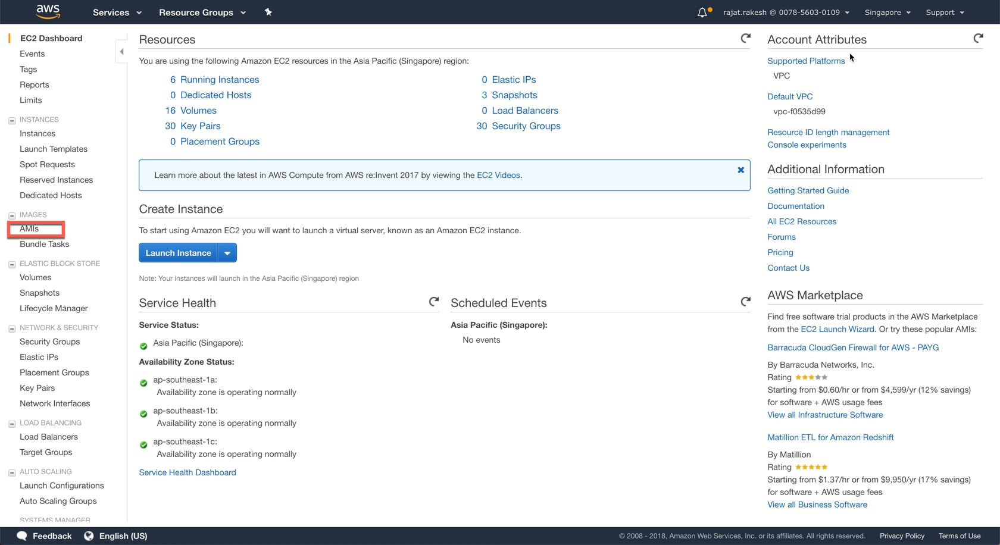
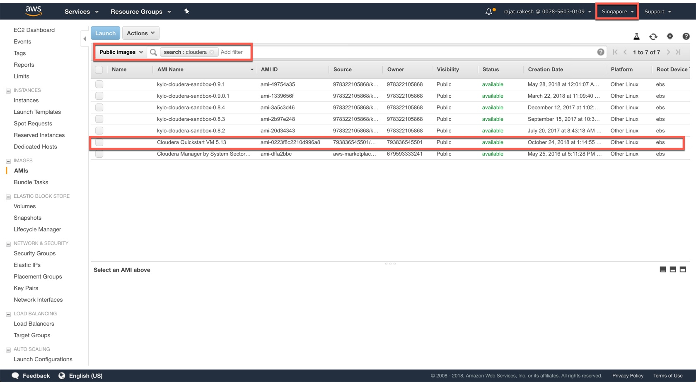
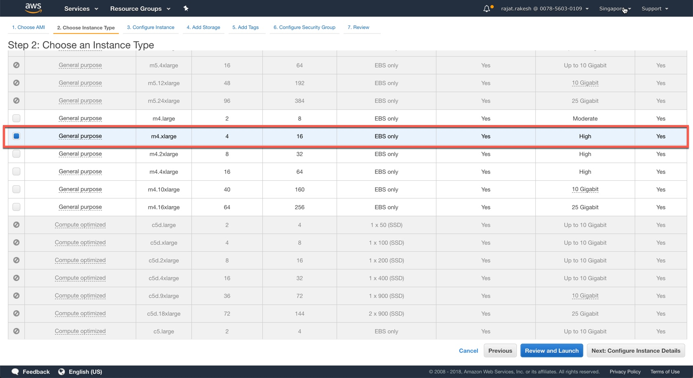
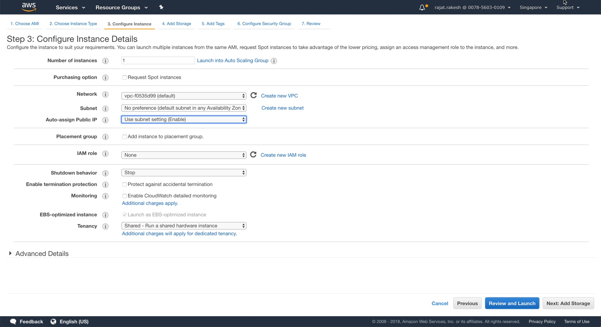
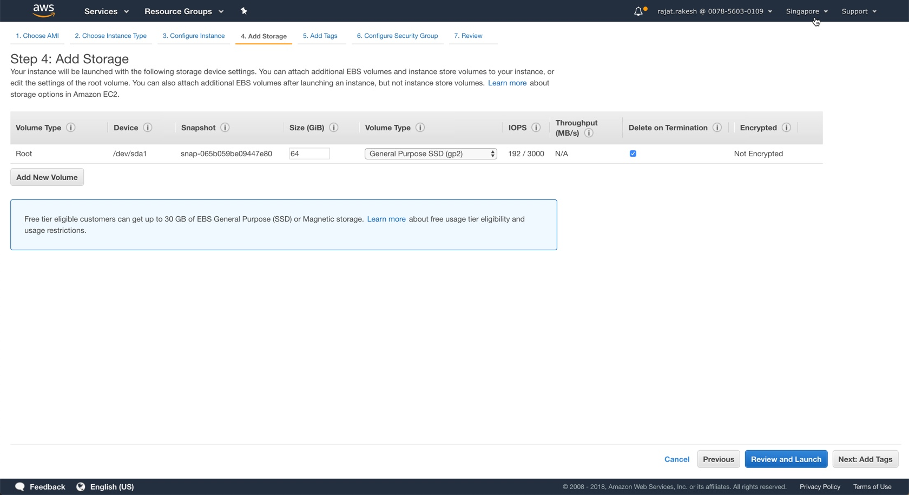
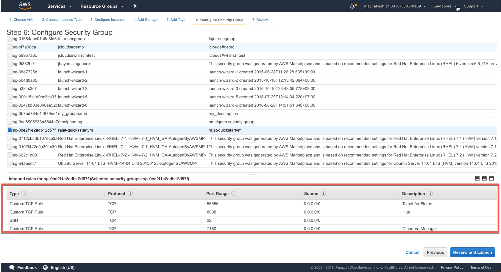
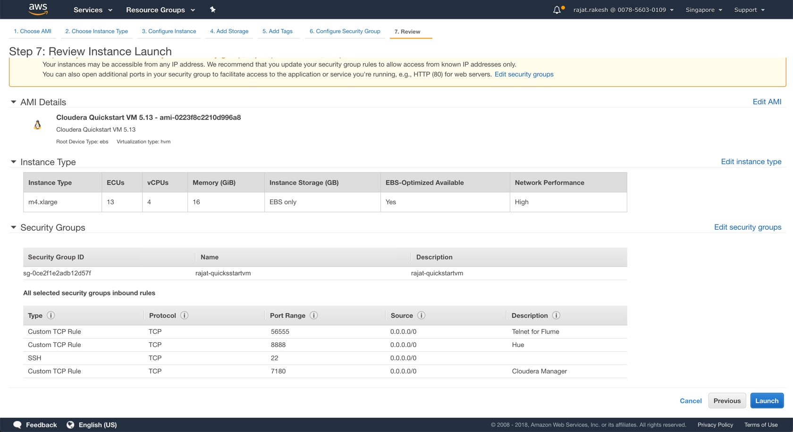
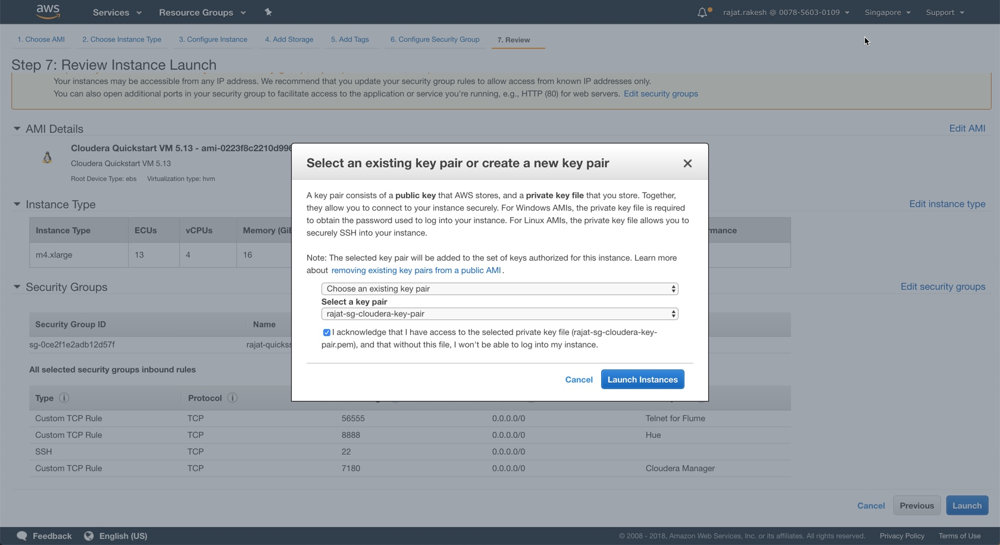
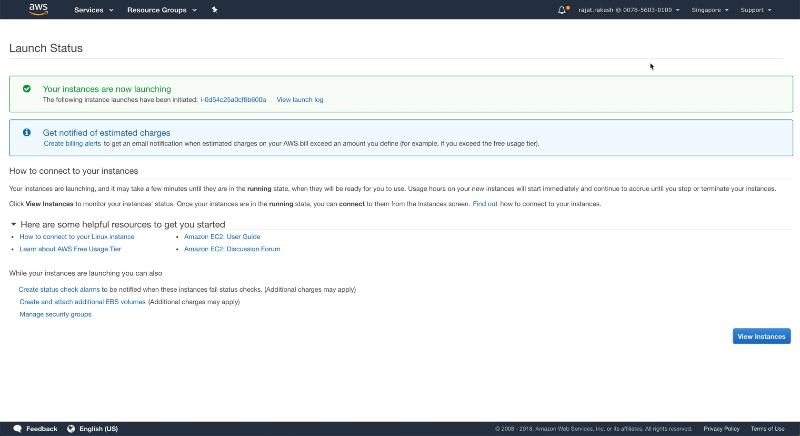
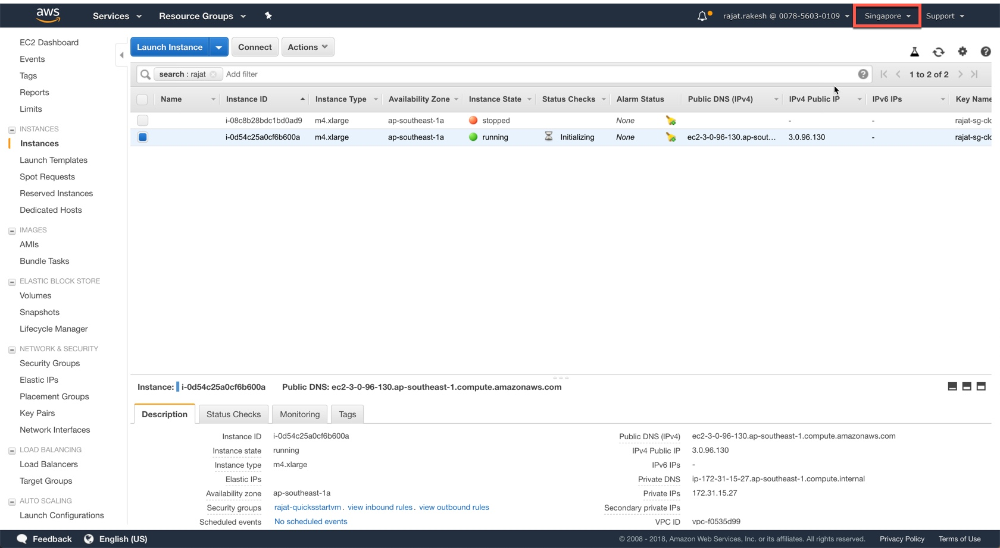

## AWS Deployment of Cloudera Quickstart VM 5.13

For the bigdatalabs, while the preferred option is to deploy this virtual machine locally using a laptop, as it provides most flexibility, at the same time it requires minimum 16GB ram to be available on the laptop. 

Given this, another option to run the entire labs is to deploy the Cloudera Quickstart VM on to AWS. This makes it easier to run as you can bring up the instance quickly, assign more RAM or leverage this in a demo/mini pilot. The below tutorial provides a how-to guide on doing so. 

*The tutorial assumes that you have acccess to an AWS paid account with the necessary privileges to create EC2 instances*

After logging in your AWS account, navigate to the EC2 services screen and click the AMI sub section.

Filter the list of AMIs: Search for 'Cloudera' in Public AMI in the 'Singapore' region (top right). We will be using the highlighted AMI - this is the exact Cloudera Quickstart 5.13 virtual machine image that is available for download from Cloudera's website. We have converted this to Amazon AMI format and made it available for the lab.

Click Launch to deploy this AMI. The next screen shows the various options for instance shapes. We suggest using an m4.xlarge (4 core, 15 GB RAM) or higher. After selecting the correct instance, do NOT click 'Review and Launch' as we still need to make some edits. Instead, Click 'Next: Configure Instasnce Details'. 

No major changes are required in this screen. If you already have a preferred VPC that you would like to use, then select that, else a default would be selected for you (you can also create a new one here).  Make sure the option for 'Auto-assign Public IP' is selected and Enabled. If not, you would not be able to access your VM image running on AWS from your laptop. Leave all options as it is and click 'Next: Add Storage'.

By default, the VM image is configured with 64GB of General Purpose SSD. If you would like to increase the storage capacity of the VM instance, you can add more volumes here (this can also be done later). Make sure the 'Delete on Termination' option is selected - this will ensure that the disk volume is auto-destroyed when the VM isntance is terminated. Click 'Next: Add Tags'

No changes are required in the next screen though we do recommend adding tags for searching through your deployed instances esp. if you have a lot of them deployed. Click 'Next'.

The next screen is an important one. Here we need to select the ports that will need to be opened so that we can access Hue, Cloudera Manager from your local machine. On this screen, you can either select an existing security group which has the list of all the ports that you would like to open, or you can create a new security group which has atleast the following four ports open (additional ports if needed, can be added later): 

* 56555 - this will be used during the Flume workshop
* 8888 - Port for Hue
* 22 - Port for SSH
* 7180 - Port for Cloudera Manager

Click 'Review and Launch'.

**Important: In the screenshot, all ports are open '0.0.0.0/0'. We HIGHLY RECOMMEND locking it down to a specific set of IPs to avoid anyone else accessing your VM instance. In this tutorial, the ports are currently open to all.**

The final screen shows the summary of all the settings that you have configured. The top screen also shows a warning if your instance is accessible from any IP address - not recommended. If everything is ok, then click 'Launch'.

The next screen will give an option for creating a private key **Highly Recommended**. This will provide an additional option to secure your instance. You could choose an existing key-pair that you have on your account, or you can create a new one. Remember to download the key-pair on your local laptop, if you are creating a new one. Click 'Launch Instances'.

The next screen will show a confirmation that you instance is being launched. Click 'View Instances' to see the status. 

This screens shows all the instances that are currently active/launched/stopped in your AWS account for the current 'Region' selected. In our case, we are launching all instances in the 'Singapore' region. (Top right corner). On selecting the instance, it also shows the Public IP (in our case: 3.0.96.130). We will connect to the instance via ssh via the Terminal App.

Let's connect to our instance using our public IP and our private key that we had downloaded. Before you use the private key (*.pem file), we strongly recommend changing the properties of the file:

	sudo chmod 600 ** name of pem file **

Then connect to the instance by typing:

	ssh -i FileName.pem cloudera@Public IP

The default userid/password setup in the instance is cloudera/cloudera

There are a few additional steps required for final checks, start-up sequence etc. They are available [here](https://github.com/rajatrakesh/bigdatalab/blob/master/01-Setup/Startup.MD)

#### This concludes this tutorial

