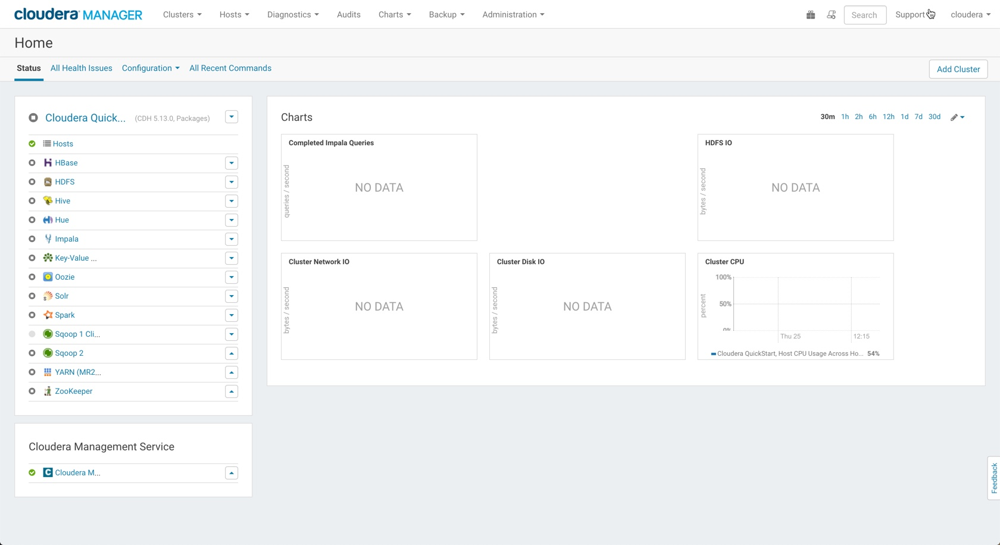

### Post Setup (AWS/VirtualBox)

Once you have setup the Quickstart VM, either on AWS or using Virtualbox, there are a couple of steps required to configure the Cloudera Manager Enterprise (Trial). 

By default, the instance is configured to work on the free Cloudera Managere Express version. The following command would need to be executed to configure the instance to work with the Enterprise version. **Note:** This needs to be done only once, the very first time when you start the VM. 

We can do this by typing this in our terminal session (either in ssh to AWS or inside the VM instance)

	sudo /home/cloudera/cloudera-manager --pause --enterprise

This will configure and activate Cloudera Manager Enterprise (60 day trial) in your instance. After 60 days, you would either need to get a valid license file from Cloudera (if you have a paid subscription) or switch back to Cloudera Express (certain features may not be available). 

Once the setup is complete, you would be able to access Cloudera Manager in your local laptop browser by using the url: 

	http://quickstart.cloudera:7180/cmf/login

#### Instructions

After restart, click the Cloduera Manager option in Firefox and wait for Cloudera Manager to start up. Sometimes, this can take more than 15 mins. 

#### Issues

After startup, you may see multiple issues in Cloudera Manager. Let's try and address the most important ones as follows:
* Host Monitor - Need to start
* Services Monitor - Need to start
* Management Console - Need to re-start
* There would be a lot of configuration related warnings that would be displayed. This is NORMAL, since the Virtual machine has only one node. Suppress all warnings/issues being displayed. 

#### Startup

Start the services in the following order:

* Zookeeper
* YARN
* HDFS
* Hive
* Impala
* HBase
* Oozie
* Hue

**Note**
* Do NOT start Spark, Solr, Key Value, SQOOP

This is the bare minimum of services that would be required in the first lab. There would be further installations and configurations that would be required in the labs that will follow. 
