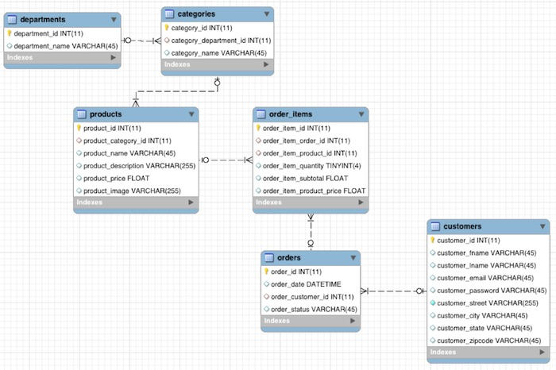
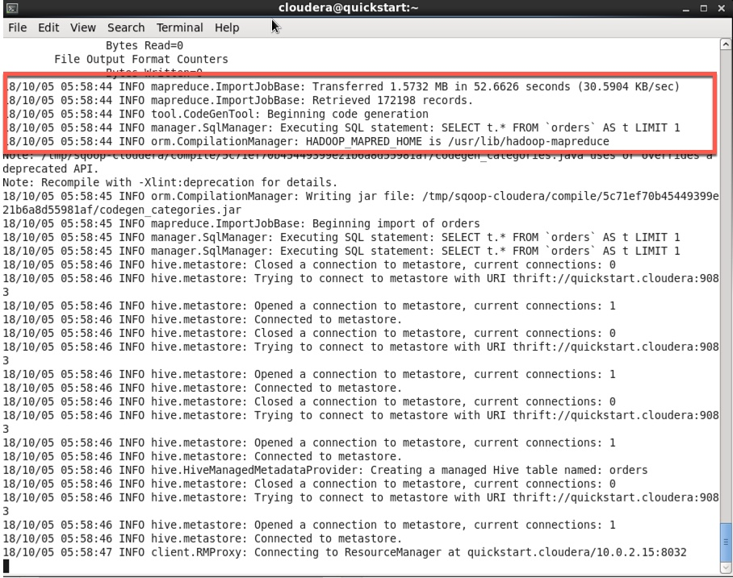
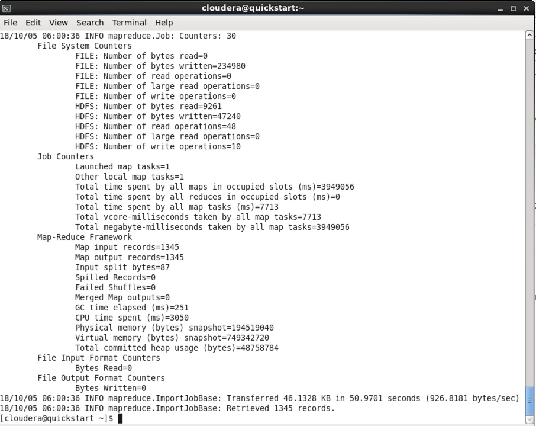
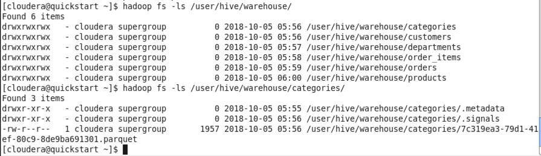
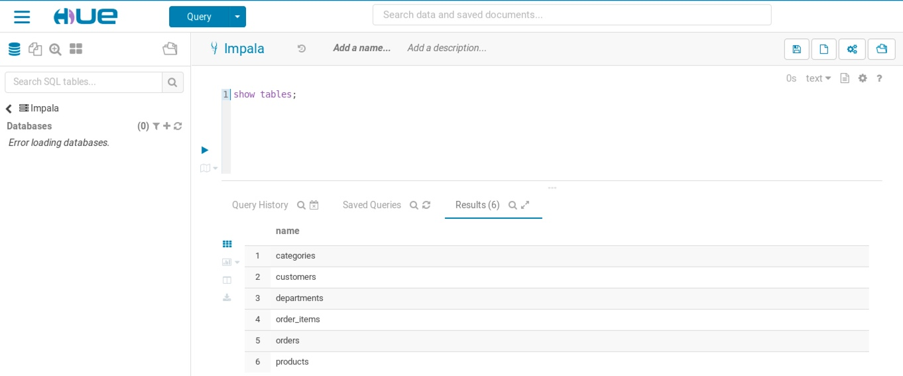
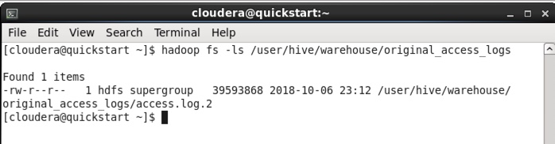
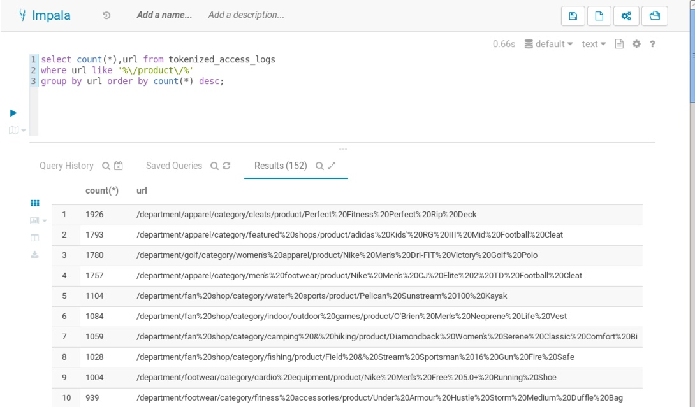

## Hive Lab

### Data Ingestion

For this lab, we will start with the basics of data ingestion in hive. For your benefit, certain datafiles and samples have already been loaded in the VM image. 

There are multiple ways of ingesting data into CDH. For the purpose of these labs, we will focus on:

* Relational Data Ingestion via SQOOP
* Data Ingestion via command line into HDFS

#### Data Ingestion: SQOOP

We will ingest data from MySQL database using SQOOP. The Mysql datamodel looks like this



To ingest this data, we will use the following SQOOP command (execute this on terminal)

	[cloudera@quickstart ~]$ sqoop import-all-tables \
		-m 1 \
    	--connect jdbc:mysql://quickstart:3306/retail_db \
    	--username=retail_dba \
    	--password=cloudera \
    	--compression-codec=snappy \
    	--as-parquetfile \
    	--warehouse-dir=/user/hive/warehouse \
    	--hive-import

You will see a series of map-reduce jobs being executed, and there may be a few errors being showed as well - This is NORMAL. 



The process will run for around 10 minutes+ and then you will see messages like below that data has been successfully loaded. 



Let's valdiate that the data has been succesfully loaded. 

	[cloudera@quickstart ~]$ hadoop fs -ls /user/hive/warehouse/
	[cloudera@quickstart ~]$ hadoop fs -ls /user/hive/warehouse/categories/
	

	
Since we used the SQOOP command, the data has been loaded in HDFS in parquet format, and the required tables have already been created. If we had loaded data using the 'put' option, then we would need to create the tables, using ```CREATE EXTERNAL TABLE```

#### Hue 

Once the data has been loaded, let's validate the data from Hue. Launch Hue using the bookmark provided in the browser or typing http://cloudera.quickstart:8888/

The userid/password to access hue would be cloudera/cloudera

The first thing we need to do is open the Impala Query Editor and execute the following:

	INVALIDATE METADATA;
	
This will refresh the catalog in impala and you would be able to see the tables created in the previous steps by typing:

	SHOW TABLES;
	


Mini-Lab:1

* Write a query to find the most popular products
HINT: Use order quantity. Join product and categories

Mini-Lab:2

* Write a query to find out the top 10 products, based on revenue

#### Data Ingestion: Finding Value with Unstructured Data

For this example, we will use web clickstream data. The most common way to ingest web clickstream is to use Flume. We will use flume in a later lab to explore this. 

For the current use case, we will provide a pre-prepared web clickstream data set that you can bulk upload into HDFS directly.

The dataset (about 180K lines) is one month's worth of sample access log data and available at /opt/examples/log_files/access.log.2.

Let's load this data into HDFS.

* First, let's create a directory where this data will reside.
* Then we use the copyFromLocal (you can use put as well) to copy the data from local storage to HDFS

		[cloudera@quickstart ~]$ sudo -u hdfs hadoop fs -mkdir /user/hive/warehouse/original_access_logs
		[cloudera@quickstart ~]$ sudo -u hdfs hadoop fs -copyFromLocal /opt/examples/log_files/access.log.2 /user/hive/warehouse/original_access_logs
		

* Verify that the data is successfully copied.

		[cloudera@quickstart ~]$ hadoop fs -ls /user/hive/warehouse/original_access_logs
		


* Now we need to build a table on this data using Hive and query it using Impala. For this, we will advantage of Hive's flexible SerDes (serializers / deserializers) to parse the logs into individual fields using a regular expression. 
* We will then transfer the data from this intermediate table to one that does not require any special SerDe. Once the data is in this table, you can query it much faster and more interactively using Impala.

Execute the following query in the Hive Query Editor (not Impala Query Editor)

		CREATE EXTERNAL TABLE intermediate_access_logs (
		    ip STRING,
		    date STRING,
		    method STRING,
		    url STRING,
		    http_version STRING,
		    code1 STRING,
		    code2 STRING,
		    dash STRING,
		    user_agent STRING)
		ROW FORMAT SERDE 'org.apache.hadoop.hive.contrib.serde2.RegexSerDe'
		WITH SERDEPROPERTIES (
		    'input.regex' = '([^ ]*) - - \\[([^\\]]*)\\] "([^\ ]*) ([^\ ]*) ([^\ ]*)" (\\d*) (\\d*) "([^"]*)" "([^"]*)"',
		    'output.format.string' = "%1$$s %2$$s %3$$s %4$$s %5$$s %6$$s %7$$s %8$$s %9$$s")
		LOCATION '/user/hive/warehouse/original_access_logs';
		
* Create an external table on this new table

		CREATE EXTERNAL TABLE tokenized_access_logs (
		    ip STRING,
		    date STRING,
		    method STRING,
		    url STRING,
		    http_version STRING,
		    code1 STRING,
		    code2 STRING,
		    dash STRING,
		    user_agent STRING)
		ROW FORMAT DELIMITED FIELDS TERMINATED BY ','
		LOCATION '/user/hive/warehouse/tokenized_access_logs';
		
		ADD JAR /usr/lib/hive/lib/hive-contrib.jar;
		
* And finally, insert data into the new table (this may take a few minutes)

		INSERT OVERWRITE TABLE tokenized_access_logs SELECT * FROM intermediate_access_logs;
		
* Switch to Impala Query Editor and just like before, refresh the metadata to let impala know that some tables have been created. Then execute the query on the new table.

		invalidate metadata;
		
		select count(*),url from tokenized_access_logs
		where url like '%\/product\/%'
		group by url order by count(*) desc;



This concludes our Hive Lab.
