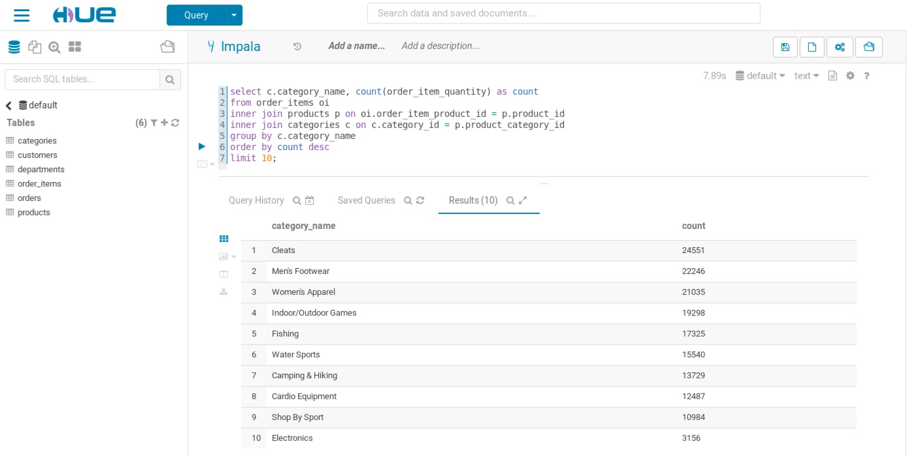
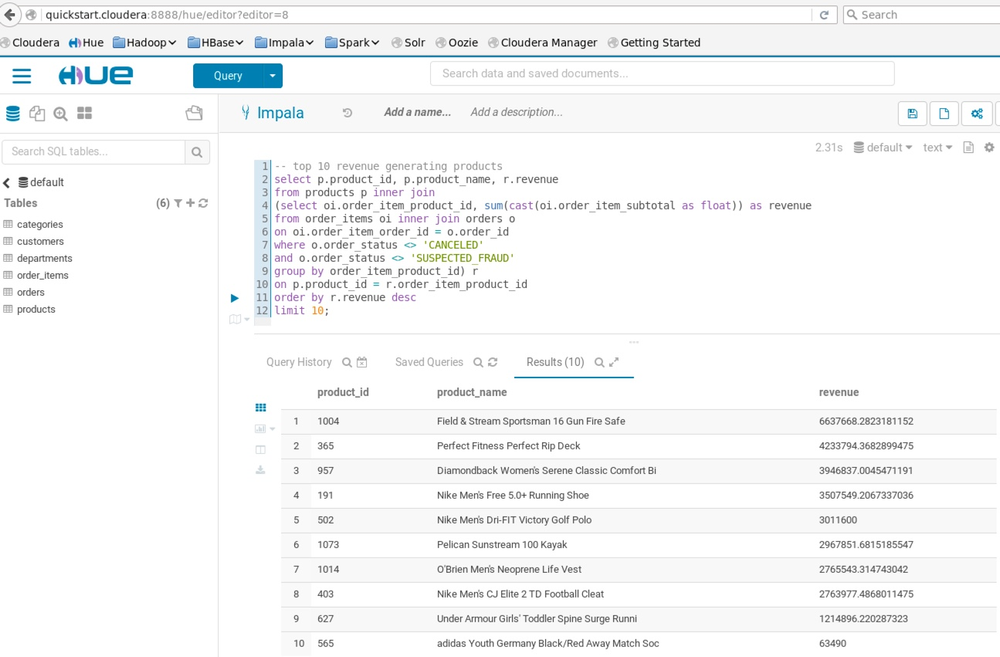

### Mini-Lab:1

* Write a query to calculcate total revenue per product and showing the top 10 revenue generating products

* Most Popular Product Categories

		select c.category_name, count(order_item_quantity) as count
		from order_items oi
		inner join products p on oi.order_item_product_id = p.product_id
		inner join categories c on c.category_id = p.product_category_id
		group by c.category_name
		order by count desc
		limit 10;
		

### Mini-Lab:2
* Write a query to find the top 10 revenue generating products

* Top 10 Revenue Generating Products

		select p.product_id, p.product_name, r.revenue
		from products p inner join
		(select oi.order_item_product_id, sum(cast(oi.order_item_subtotal as float)) as revenue
		from order_items oi inner join orders o
		on oi.order_item_order_id = o.order_id
		where o.order_status <> 'CANCELED'
		and o.order_status <> 'SUSPECTED_FRAUD'
		group by order_item_product_id) r
		on p.product_id = r.order_item_product_id
		order by r.revenue desc
		limit 10;
		

