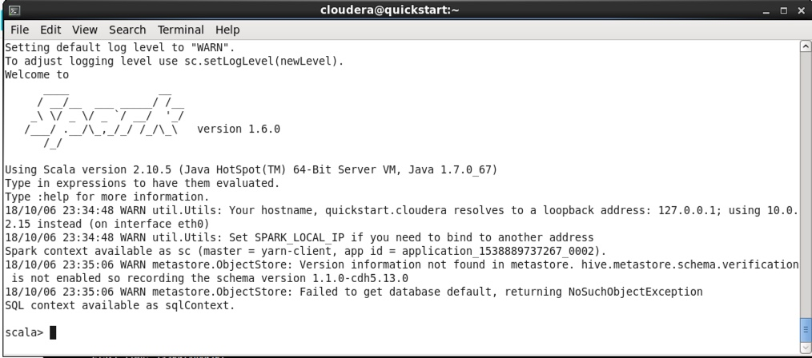
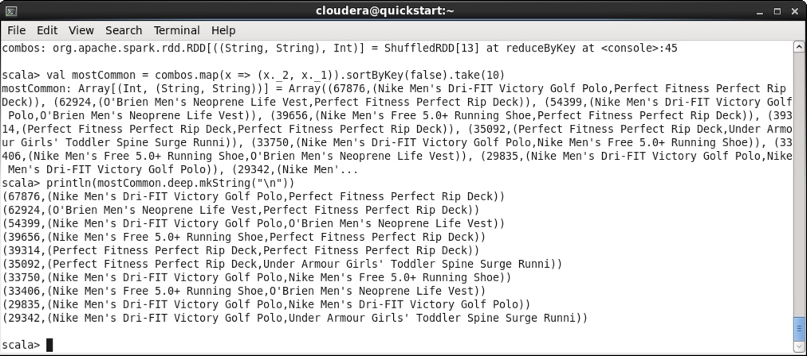

### Spark Lab

You come up with a great idea that it would be interesting for the marketing team which products are most commonly purchased together. Perhaps there are optimizations to be made in marketing campaigns to position components together that will generate a strong lead pipeline? Perhaps they can use product correlation data to help up sales for the lesser viewed products? 

The tool in CDH best suited for quick analytics on object relationships is Apache Spark. You can compose a Spark job to do this work and give you insight on product relationships.

In this lab, we will track product associations and leverage the work done in the previous labs. 

* Launch a spark session in shell

spark-shell --master yarn-client

If everything starts successfully, you would then get a screen like below, with the scala prompt:

On the scala prompt, let's copy and paste the following code:

* First we're going to import the classes we need

		import org.apache.hadoop.mapreduce.Job
		import org.apache.hadoop.mapreduce.lib.input.FileInputFormat
		import org.apache.avro.generic.GenericRecord
		import parquet.hadoop.ParquetInputFormat
		import parquet.avro.AvroReadSupport
		import org.apache.spark.rdd.RDD

* Then we create RDD's for 2 of the files we imported from MySQL with Sqoop. RDD's are Spark's data structures for working with distributed datasets.

		def rddFromParquetHdfsFile(path: String): RDD[GenericRecord] = {
		    val job = new Job()
		    FileInputFormat.setInputPaths(job, path)
		    ParquetInputFormat.setReadSupportClass(job,
		        classOf[AvroReadSupport[GenericRecord]])
		    return sc.newAPIHadoopRDD(job.getConfiguration,
		        classOf[ParquetInputFormat[GenericRecord]],
		        classOf[Void],
		        classOf[GenericRecord]).map(x => x._2)
		}
		
		val warehouse = "hdfs://quickstart/user/hive/warehouse/"
		val order_items = rddFromParquetHdfsFile(warehouse + "order_items");
		val products = rddFromParquetHdfsFile(warehouse + "products");
		
* Next, we extract the fields from order_items and products that we care about and get a list of every product, its name and quantity, grouped by order

		val orders = order_items.map { x => (
		    x.get("order_item_product_id"),
		    (x.get("order_item_order_id"), x.get("order_item_quantity")))
		}.join(
		  products.map { x => (
		    x.get("product_id"),
		    (x.get("product_name")))
		  }
		).map(x => (
		    scala.Int.unbox(x._2._1._1), // order_id
		    (
		        scala.Int.unbox(x._2._1._2), // quantity
		        x._2._2.toString // product_name
		    )
		)).groupByKey()
		
* Finally, we tally how many times each combination of products appears together in an order, then we sort them and take the 10 most common

		val cooccurrences = orders.map(order =>
		  (
		    order._1,
		    order._2.toList.combinations(2).map(order_pair =>
		        (
		            if (order_pair(0)._2 < order_pair(1)._2)
		                (order_pair(0)._2, order_pair(1)._2)
		            else
		                (order_pair(1)._2, order_pair(0)._2),
		            order_pair(0)._1 * order_pair(1)._1
		        )
		    )
		  )
		)
		val combos = cooccurrences.flatMap(x => x._2).reduceByKey((a, b) => a + b)
		val mostCommon = combos.map(x => (x._2, x._1)).sortByKey(false).take(10)
		
*  Lastly, we print our results, 1 per line, and exit the Spark shell

		println(mostCommon.deep.mkString("\n"))
		
		exit

The output would look like this: 

If it weren't for Spark, doing cooccurrence analysis like this would be an extremely arduous and time-consuming task. However, using Spark, and a few lines of scala, you were able to produce a list of the items most frequently purchased together in very little time. 

#### End of Spark Lab.
