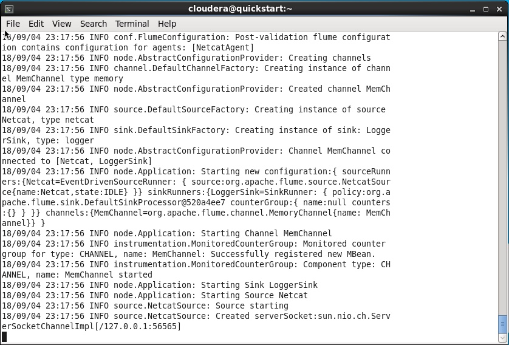
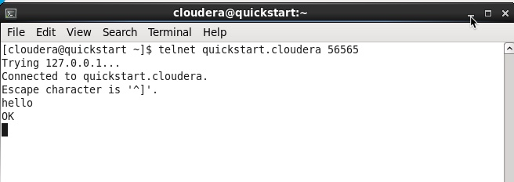
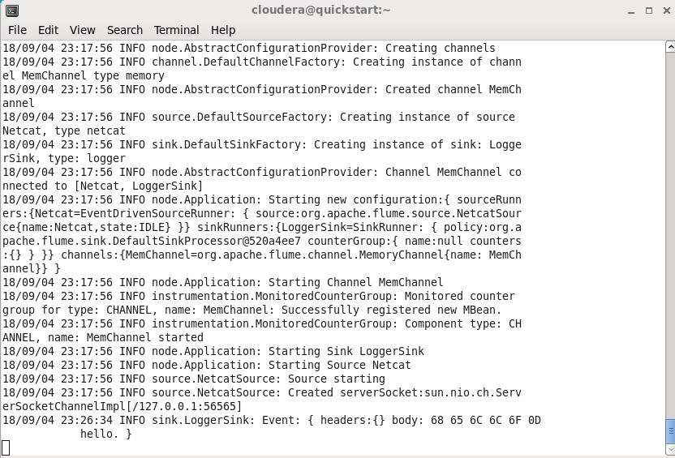
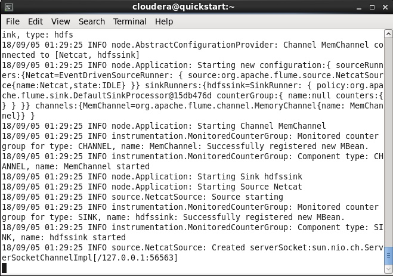
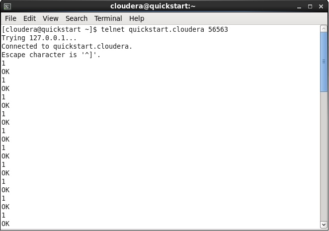
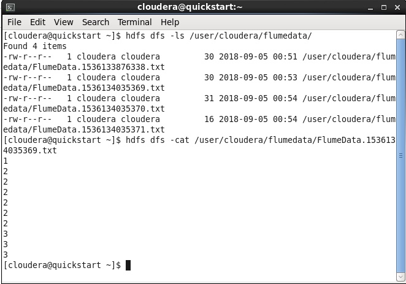
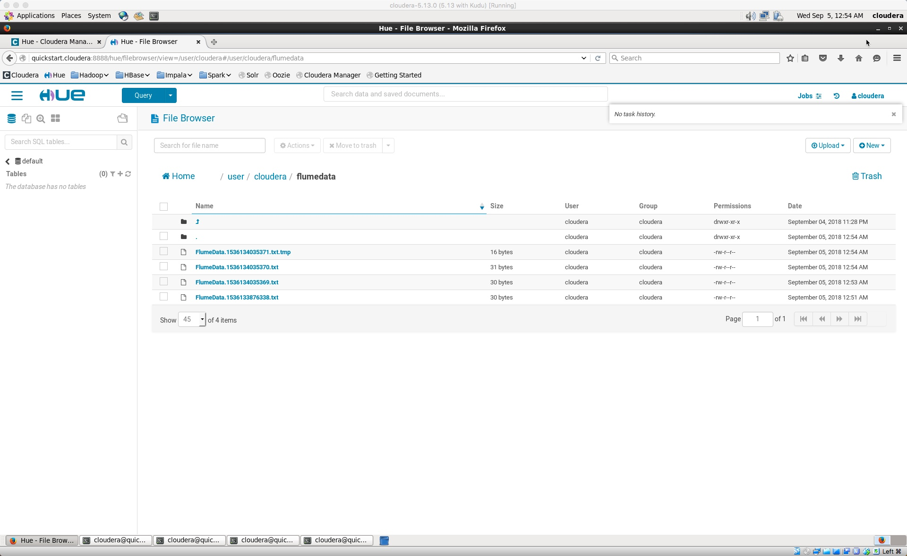

### Flume Hands-On

###  Lab 1: Writing Data from a netcat agent to HDFS

For this lab, we will simulate traffic coming from a clickstream or sensor device. For this, we will create a datastream using telnet and netcat session. By default, telnet is not installed on the VM image. Let's start with the installation.

#### Install Telnet Client 

	$ sudo yum install telnet-server telnet
			
#### Setup Flume Conf File (home) net.conf

	# Naming the components on the current agent

	NetcatAgent.sources = Netcat
	NetcatAgent.channels = MemChannel
	NetcatAgent.sinks = LoggerSink

	# Describing/Configuring the source

	NetcatAgent.sources.Netcat.type = netcat
	NetcatAgent.sources.Netcat.bind = quickstart.cloudera
	NetcatAgent.sources.Netcat.port = 56565
	NetcatAgent.sources.Netcat.channels = MemChannel

	# Describing/Configuring the sink
	
	NetcatAgent.sinks.LoggerSink.type = logger
	NetcatAgent.sinks.LoggerSink.channel = MemChannel
	
	# Describing/Configuring the channel
	
	NetcatAgent.channels.MemChannel.type = memory
	NetcatAgent.channels.MemChannel.capacity = 1000
	NetcatAgent.channels.MemChannel.transactionCapacity = 100
	
#### Start Flume Agent

* Start the flume agent with the config file setup above

		flume-ng agent -f net.conf --name NetcatAgent -Dflume.root.logger=INFO,console
	
		
#### Start a Netcat process in a seperate terminal window

* Start a telnet session in another terminal window and after starting, start typing text. This will show up in the flume agent window, showing a successful read. 

		telnet quickstart.cloudera 56565
		
* Type 'Hello' in the netcat window

* You would see this text appear in the flume window

This shows that flume is able to pickup data successfully from the session. You can close both the session windows (Flume and Netcat) after this exercise.

#### Create a directory in HDFS to capture flume data

	hdfs dfs -mkdir /user/cloudera/flumedata
	hdfs dfs -ls /user/cloudera
	
#### Create a Conf File to Write to HDFS from another Flume Agent nethd.conf

	NetcatAgent.sources = Netcat
	NetcatAgent.channels = MemChannel
	NetcatAgent.sinks = hdfssink
	
	NetcatAgent.sources.Netcat.type = netcat
	NetcatAgent.sources.Netcat.bind = quickstart.cloudera
	NetcatAgent.sources.Netcat.port = 56563
	NetcatAgent.sources.Netcat.channels = MemChannel
	
	NetcatAgent.channels.MemChannel.type = memory
	NetcatAgent.channels.MemChannel.capacity = 1000
	
	# Define a source on agent and connect to channel memoryChannel. 
	
	NetcatAgent.sinks.hdfssink.type = hdfs 
	NetcatAgent.sinks.hdfssink.channel = MemChannel 
	NetcatAgent.sinks.hdfssink.hdfs.path = /user/cloudera/flumedata/
	NetcatAgent.sinks.hdfssink.hdfs.fileType = DataStream
	NetcatAgent.sinks.hdfssink.hdfs.writeFormat = Text
	NetcatAgent.sinks.hdfssink.hdfs.filePrefix=
	NetcatAgent.sinks.hdfssink.hdfs.fileSuffix=.txt

#### Start second Flume Agent to write data to HDFS

	flume-ng agent -f nethd.conf --name NetcatAgent -Dflume.root.logger=INFO,console
	

* Start a second telnet window to write data to the console
	
		telnet quickstart.cloudera 56563
		
* Type 1 and hit enter to create a few different transactions
		

* Check for data being written in HDFS. Open a new terminal window and type the following (the name of the file in the second line may change, depending on the date. Use the filename that shows on your screen):

		hdfs dfs -ls /user/cloudera/flumedata
		hdfs dfs -cat /user/cloudera/flumedata/FlumeData.1536134035369.txt

* Check for the data using Hue

### Mini-Lab

* Connect to twitter using Flume
* Download tweets and land the tweets into HDFS
* Create a table to query the tweets
