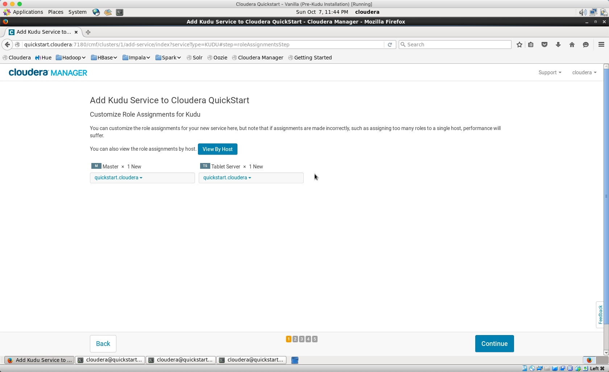
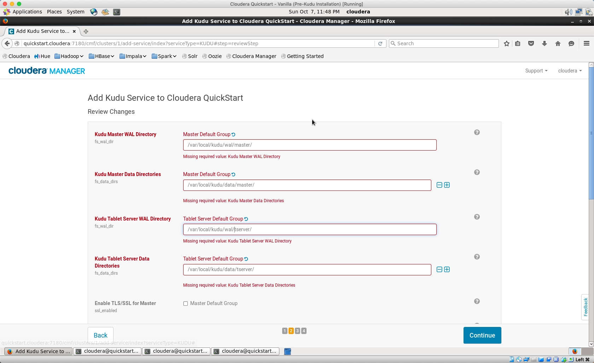
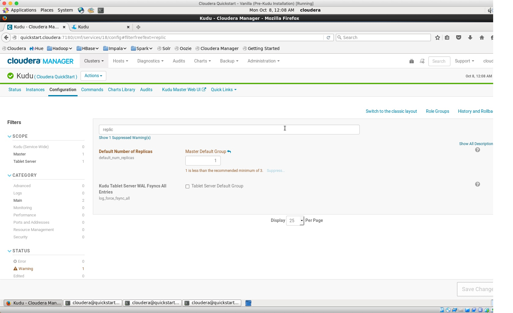

### Kudu Hands-On Lab

#### Kudu Installation
We'll install Kudu through the package that we pre-downloaded, as mentioned in the README.md. To install Kudu, simply execute the following in the terminal window:

	sudo yum install kudu kudu-master kudu-tserver

Now let's add the Kudu Service to your deployment. The configuration settings are quite easy. 

Select the tablet and master server

Now set up the storage path for Master, Tablet and WAL directories. I suggest the following directory structure (you don't need to create them, they will be setup automatically):

	/var/local/kudu/wal/master/
	/var/local/kudu/data/master/
	/var/local/kudu/wal/tserver/
	/var/local/kudu/data/tserver/

Now we need to setup the default no of replicas to 1. This will need to be done after the service is deployed. You can access this setting from the configuration tab.

*Hint: If you get errros in the Kudu deployment screen, then open another cloudera manager session in browser, navigate to the Kudu configuration and make the change listed above and click the save button. Then return to the previous Kudu installation session in Cloudera Manager and click finish. The process will complete successfully now.*

#### Loading Data Into Kudu

* Let's upload some sample data into our HDFS cluster. For this exercise, we will download the sample dataset from SF MTA's website at [http://kudu-sample-data.s3.amazonaws.com/sfmtaAVLRawData01012013.csv.gz](http://kudu-sample-data.s3.amazonaws.com/sfmtaAVLRawData01012013.csv.gz)

The original dataset has some issues with DOS-style line endings, so will convert it to unix using the `tr` option.

* Download the Data:

		wget http://kudu-sample-data.s3.amazonaws.com/sfmtaAVLRawData01012013.csv.gz

* Create a Directory in HDFS

		hdfs dfs -mkdir /user/cloudera/kudu

* Convert and Upload the Data into HDFS

		zcat sfmtaAVLRawData01012013.csv.gz | tr -d '\r' | hadoop fs -put - /user/cloudera/kudu/data.csv

* Let's create a new impla table to access this data, while in text format

		ssh cloudera@quickstart.cloudera -t impala-shell

* Create a table in Impala to access RAW data:
	
		CREATE EXTERNAL TABLE sfmta_raw (
		revision int,    
  		report_time string,  
  		vehicle_tag int,  
  		longitude float,  
  		latitude float,  
  		speed float,  
  		heading float  
		)  
		ROW FORMAT DELIMITED  
		FIELDS TERMINATED BY ','  
		LOCATION '/user/cloudera/kudu/'  
		TBLPROPERTIES ('skip.header.line.count'='1');

* Validate that the data is accessible:
	
		SELECT count(*) FROM sfmta_raw;

		+----------+
		| count(*) |
		+----------+
		| 859086   |
		+----------+
	
* Create a Kudu Table and load the data, the report_time field needs to be converted to unix-style timestamp for more efficient storage

	
		CREATE TABLE sfmta  
		PRIMARY KEY (report_time, vehicle_tag)
		PARTITION BY HASH(report_time) PARTITIONS 4
		STORED AS KUDU 
		TBLPROPERTIES
		(
		'kudu.master_addresses' = 'quickstart.cloudera:7051'
		)
		AS SELECT
  			UNIX_TIMESTAMP(report_time,  'MM/dd/yyyy HH:mm:ss') AS report_time,
  			vehicle_tag,
  			longitude,
  			latitude,
  			speed,
  			heading
		FROM sfmta_raw;

		+------------------------+
		| summary                |
		+------------------------+
		| Inserted 859086 row(s) |
		+------------------------+
		Fetched 1 row(s) in 5.75s

#### Reading and Modifying Data

* Now that our data is in Kudu, we can run queries against that:

		SELECT * FROM sfmta ORDER BY speed DESC LIMIT 1;

		+-------------+-------------+--------------------+-------------------+-------------------+---------+
		| report_time | vehicle_tag | longitude          | latitude          | speed             | heading |
		+-------------+-------------+--------------------+-------------------+-------------------+---------+
		| 1357022342  | 5411        | -122.3968811035156 | 37.76665878295898 | 68.33300018310547 | 82      |
		+-------------+-------------+--------------------+-------------------+-------------------+---------+
		
* Let's try and delete a record:

		DELETE FROM sfmta WHERE vehicle_tag = 5411;

		-- Modified 1169 row(s), 0 row error(s) in 0.25s
		
#### End of Kudu Lab

#### Reference Articles

* [https://kudu.apache.org/docs/](https://kudu.apache.org/docs/)
* [Blog: Using Impala with Kudu](http://blog.cloudera.com/blog/2015/11/how-to-use-impala-with-kudu/)
* Kudu Examples [Github](https://github.com/cloudera/kudu-examples)
* Developing Examples with Kudu [Documentation](https://www.cloudera.com/documentation/enterprise/5-14-x/topics/kudu_development.html)
* Kudu Applications [kudu.apache.org](https://kudu.apache.org/docs/developing.html)
* Spark on Kudu [Cloudera Blog](http://blog.cloudera.com/blog/2017/02/up-and-running-with-apache-spark-on-apache-kudu/)
